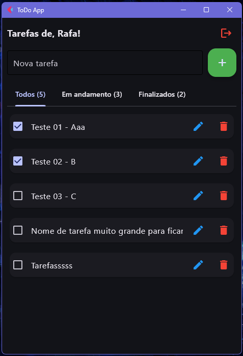

# 📝 ToDo App

A simple and functional task management application, built with Flet
 for the frontend and FastAPI for the backend.

The ToDo App allows users to sign up, log in, and manage their tasks with inline editing, filtering by status, and secure logoff.

---

# 🚀 Features

🔐 User authentication (sign up and login with JWT)

➕ Add tasks

✏️ Edit tasks directly in the list

✅ Mark tasks as completed or in progress

❌ Delete tasks

📂 Filter tabs: All, In progress, Completed

👋 Logoff to end the session

---

# 🛠️ Tech Stack

**Python**

[Flet](https://flet.dev)
 (cross-platform frontend in Python)

[FastAPI](https://fastapi.tiangolo.com/)
 (backend API)

[SQLite](https://sqlite.org/)
 (database)

[httpx](https://www.python-httpx.org/)
 (HTTP requests)

---

📸 Preview

---

# 📂 Project Structure
ToDo/
 └─ src/
     └─ todo/
         ├─ frontend/      # Frontend code (Flet)
         │   └─ app.py
         └─ backend/       # Backend code (FastAPI)
             └─ main.py

---

# ⚙️ How to Run
1. Clone the repository
git clone https://github.com/your-username/todo-app.git
cd todo-app

2. Install dependencies
poetry install

3. Run the backend (FastAPI)
uvicorn src.todo.backend.main:app --reload

4. Run the frontend (Flet)
flet run src/todo/frontend/app.py

---

# 📌 API Endpoints

POST /auth/signup → Create an account

POST /auth/login → Login (returns JWT)

GET /users/me → Get logged user info

GET /tasks/ → List tasks

POST /tasks/ → Create a task

PUT /tasks/{id} → Update a task

DELETE /tasks/{id} → Delete a task

---

# 🤝 Contributing

Fork the project

Create your feature branch (git checkout -b feature/my-feature)

Commit your changes (git commit -m 'feat: add my feature')

Push to the branch (git push origin feature/my-feature)

Open a Pull Request 🚀

---

# 📜 License

Distributed under the [MIT](LICENSE)

---

Developed with 💻 and passion by Rafael Melo @rafael-melo